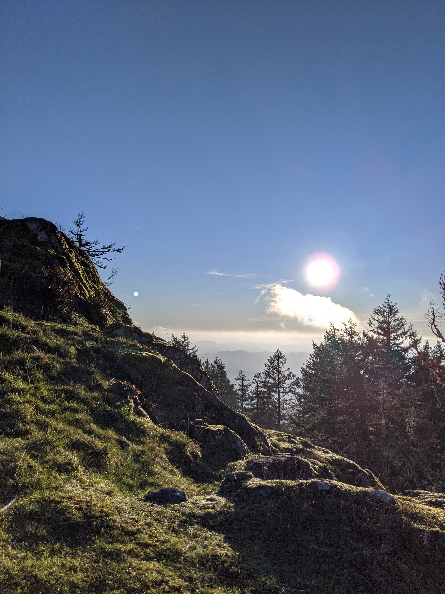

```{r package, echo = FALSE}
library(fontawesome)
```


### My professional self:

- I am quite fond of **data science** and I am advancing my skills as a data scientist including machine learning and statistical inference.
- I use **R** for all of my work, and in consequence I am always interested in learning new tools and libraries.
- I am beginning to utilize big data tools such as spark, and google cloud compute.
- I love making intriguing data visualizations, I consider it a form of `r fa(name = "palette", fill = "blue")`.

### My non-professional self:

- I love to enjoy the outdoors and explore new places! Some of my favorite activities include: `r fa(name = "campground", fill = "green")`, `r fa(name = "snowboarding", fill = "lightblue")`, and `r fa(name = "golf-ball", fill = "grey")`.
- Im a big `r fa(name = "music", fill = "black")` lover, and I hope to keep attending concerts once the pandemic recedes.
- I am also into `r fa(name = "camera-retro", fill = "black")`, albeit a phone using amateur. Here are some of my favorite shots I have taken:


<p align="middle">
  
   
  
  
</p>